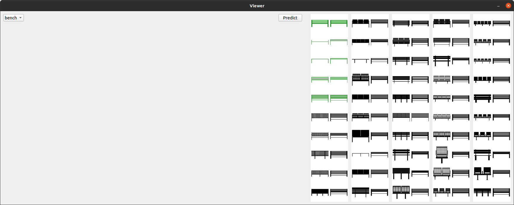
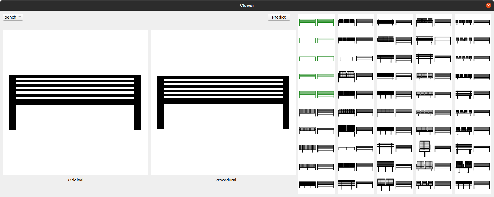

# Overview

In this experiment, we ask you to write computer code to create a set of 2D shapes in a procedural manner. The goal is to create shapes that are as similar as possible to the shapes given in the study. The shapes are simply of black color on a white background. At the end of the study, we will ask you to participate in a short survey and answer a few follow-up questions.

# Package requirements
The project is implemented using Python 3.9 and depends on the following python packages.
```
pyqt5~=5.15.6
numpy~=1.21.2
tqdm~=4.62.3
pillow~=8.4.0
torchvision~=0.11.2
scikit-learn~=1.0.2
```

# Running the program
In order to run the program, navigate to the root directory of the downloaded repository and run
```python main.py```

# The user interface
Running the program opens the user interface which you can interact with.

There are two classes of shapes in this study; bench and chair. The bench class serves as an example you can use as reference while you create procedural model for the chair class. You can switch between the bench class and the chair class using the drop-down menu in the top left corner. On the right-hand side of the interface, there is a summary panel where you can see thumbnails of all the shapes from the selected class, arranged in 5 rows. There are a total of 50 shapes in each class. For the bench class, a basic set of rules is already defined and a predictive model is developed that can predict the parameters for each shape in the class. Based on the rules and the predicted parameters, the shapes are reconstructed which are shown underneath each shape. The assistive tool also identifies which shapes are predicted well (resemble the original shapes closely, shown in black color) and clusters the other shapes into groups of similar shapes (shown in different colors). The clusters can help you find similar shapes more quickly and develop the rules faster.  
You can click on any shape from the summary pane and see the enlarged images on the left-hand side of the interface. This helps you do a side by side comparison between the original shape and the procedural shape and inspect how closely they resemble each other. You can edit the code while the interface is running and see the results of your work by clicking the predict button. You can also change the number of clusters (default is 3) by entering the new number in the input box and clicking cluster.


# Creating the procedural model
Creating a procedural model is a three-step process.
1. **Define the parameter vector:** Go to ```parameter.py``` and define the construction of the parameter vector. The ```params``` list in the ```Shape``` class defines the structure of the parameter vector. Each list-element represents an element in the parameter vector and is an object of the ```Parameter``` class. Up to five arguments can be passed to the constructor when adding a parameter. The first argument is the name assigned to the parameter. The second argument defines the type of the parameter, and is any of ```‘s’```, ```‘i’``` or ```‘b’``` (short for scalar, integer and binary, respectively). The third and the fourth argument is the minimum and maximum allowable value of the parameter. The last argument specifies the number of samples to be taken between the minimum and the maximum values when creating dataset for the predictive model. As an example, a basic construction of the parameter vector for the bench class is already done. You can use it as reference when defining the construction of your own parameter vector for the chair class.
2. **Define the rules:** Go to ```rules.py``` and implement the rules in the ```__make_chair``` function. You will draw basic shapes on an empty canvas and combine them to draw different types of chairs. You will use the values in the parameter vector to control the attributes of the basic shapes such as location and size. As an example you can use as reference, a basic construction of the bench class is already provided. You will create your own rules in a similar way for the chair class. Here is a list of methods from the drawer class that can be used to draw basic shapes.  
   - ```arc(self, xy, start, end)```: Draws an arc (a portion of a circle outline) between the ```start``` and ```end``` angles, inside the given bounding box ```xy``` (a 4-tuple). The bounding box is defined with respect to a unit square where top left is (0, 0), top right is (1, 0), bottom left is (0, 1) and bottom right is (1, 1).
   - ```chord(self, xy, start, end)```: Same as arc(), but connects the end points with a straight line.
   - ```ellipse(self, xy)```: Draws an ellipse inside the given bounding box.
   - ```line(self, xy)```: Draws a line between the coordinates in ```xy```.
   - ```pieslice(self, xy, start, end)```: Same as arc, but also draws straight lines between the end points and the center of the bounding box.
   - ```point(self, xy)```: Draws points (individual pixels) at the given coordinates.
   - ```regular_polygon(self, bounding_circle, n_sides, rotation=0)```: Draws a regular polygon inscribed in ```bounding_circle```, with ```n_sides```, and rotation of ```rotation``` degrees. The bounding circle can also be defined with respect to the unit square described before.
   - ```rectangle(self, xy)```: Draws a rectangle.
   - ```rounded_rectangle(self, xy, radius=0)```: Draws a rounded rectangle.
3. **Predict the parameter vectors:** Once you have defined the parameter vector and the rules, go to the interface and click predict. It trains a model that can predict the parameter for the given shapes. The training process takes a few minutes. After the model is trained, the shapes are reconstructed from parameters predicted by the model. From the results, you should be able to see which shapes are represented well by your rules and how you can adjust the rules to include more shapes.

# Debrief
Once you are finished with your work, please visit <https://carletonu.az1.qualtrics.com/jfe/form/SV_1Sbgs3Xe7qBxOHI> where you will find a short survey that will help us record your experience and document the findings from this study.